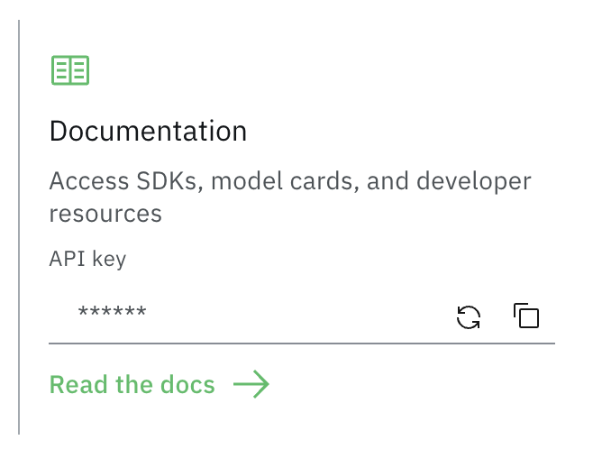

## About The Project

OpenShift LightSpeed is an AI powered assistant that runs on OpenShift and provides answers to product questions using backend LLM services.

## Getting Started

To get a local copy up and running follow these simple example steps.

### Prerequisites

* Python 3.11
* Git and pip installed
* An LLM api key, currently BAM(IBM's research environment) and OpenAI are offered as backends.

### Installation

#### Get API keys

##### BAM provided LLM
1. Get a BAM API Key at [https://bam.res.ibm.com](https://bam.res.ibm.com)
   * Login with your IBM W3 Id credentials.
   * Copy the API Key from the Documentation section.
     
2. BAM API URL: https://bam-api.res.ibm.com

##### OpenAI provided LLM
Get an [OpenAI api key](https://platform.openai.com/api-keys)

#### Install the code
1. Clone the repo
   ```sh
   git clone <project git>
   cd lightspeed-service
   ```
2. Install python packages
   ```sh
   make install-deps
   ```

#### Configure OLS

OLS configuration is in YAML format. It is loaded from a file referred to by the `OLS_CONFIG_FILE` environment variable and defaults to `olsconfig.yaml` in the current directory. 
You can find a sample configuration in the `olsconfig.yaml`` file in the top directory of this repository.  

API credentials are in turn loaded from files specified in the config yaml by the `credentials_path` attributes. If these paths are relative, 
they are relative to the current working directory. To use the example olsconfig.yaml as is, place your BAM API Key into a file named `bam_api_key.txt` in your working directory.

The example config file defines providers for both BAM and OpenAI, but defines BAM as the default provider.  If you prefer to use OpenAI, ensure that the provider definition
points to file containing a valid OpenAI api key, and change the `default_model` and `default_provider` values to reference the openai provider and model.

#### (Optional) Configure the document store
1. Download local.zip from [releases](https://github.com/ilan-pinto/lightspeed-rag-documents/releases)
2. Create vector index directory
   ```sh
      mkdir -p vector-db/ocp-product-docs
   ```
3. Unzip local.zip in vector-db/ocp-product-docs directory
   ```sh
   unzip -j <path-to-downloaded-file>/local.zip -d vector-db/ocp-product-docs
   ```

## Usage

### Local Deployment

#### Run the server
in order to run the API service
```sh
uvicorn ols.app.main:app --reload --port 8080
```

#### Query the server

To send a request to the server you can use the following curl command:
```sh
curl -X 'POST' 'http://127.0.0.1:8080/v1/query' -H 'accept: application/json' -H 'Content-Type: application/json' -d '{"query": "write a deployment yaml for the mongodb image"}'
```

### Gradio UI

There is a minimal Gradio UI you can use when running the OLS server locally.  To use it, first start the OLS server per [Run the server](#run-the-server) and then browse to the built in Gradio interface at http://localhost:8080/ui

By default this interface will ask the OLS server to retain and use your conversation history for subsequent interactions.  To disable this behavior, expand the `Additional Inputs` configuration at the bottom of the page and uncheck the `Use history` checkbox.  When not using history each message you submit to OLS will be treated independently with no context of previous interactions.

###  Swagger UI

OLS API documentation is available at http://localhost:8080/docs


### Deploying OLS on OpenShift

A Helm chart is available for installing the service in OpenShift.

Before installing the chart, you must configure the `auth.key` parameter in the [Values](helm/values.yaml) file

To install the chart with the release name `ols-release` in the namespace `openshift-lightspeed`:

```shell
helm upgrade --install ols-release helm/ --create-namespace --namespace openshift-lightspeed
```

The command deploys the service in the default configuration.

The default configuration contains OLS fronting with a [kube-rbac-proxy](https://github.com/brancz/kube-rbac-proxy).

To uninstall/delete the chart with the release name `ols-release`:

```shell
helm delete ols-release --namespace openshift-lightspeed
```

Chart customization is available using the [Values](helm/values.yaml) file.

## Roadmap

- [ ]


See the [open issues](https://github.com/othneildrew/Best-README-Template/issues) for a full list of proposed features (and known issues).

<p align="right">(<a href="#readme-top">back to top</a>)</p>


## Contributing

See [contributors](CONTRIBUTING.md) guide.

## License
Published under the Apache 2.0 License
